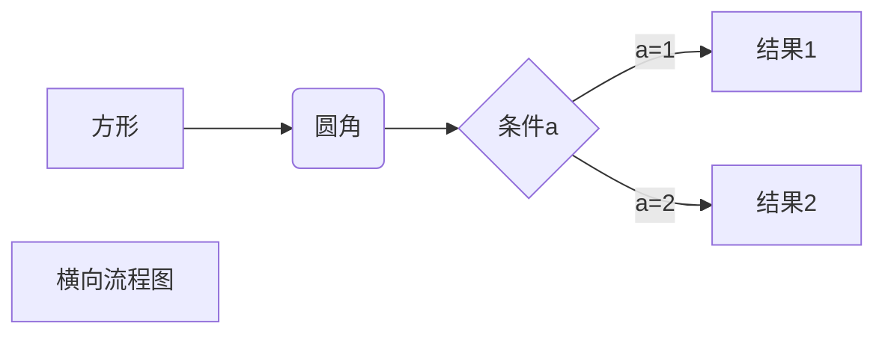

#The test of git
---
**thw===end of**
*end of*
***end of***
~printf()~
>int a = 0;
int b = 3;

dd
<http:www.baidu.com>
<https://www.runoob.com>

```mermaid
graph LR
A[方形] -->B(圆角)
    B --> C{条件a}
    C -->|a=1| D[结果1]
    C -->|a=2| E[结果2]
    F[横向流程图]
```